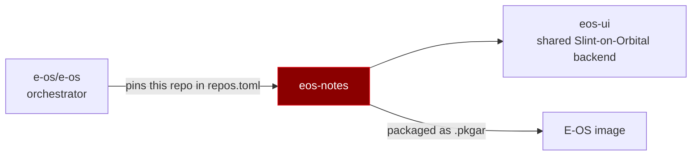

# E-OS Notes

A Crimson-themed notes application for E-OS, built on Slint with SQLite in WAL mode.

[](https://gitlab.com/e-os/eos-notes/-/pipelines)
[](LICENSE)

## Table of contents

- [What this repository is](#what-this-repository-is)
- [Where it fits](#where-it-fits)
- [Features](#features)
- [Quick start](#quick-start)
- [Requirements](#requirements)
- [Project documents](#project-documents)
- [Security](#security)
- [License and acknowledgements](#license-and-acknowledgements)

## What this repository is

First-party application (type A). Ships as `/usr/bin/eos-notes`, launcher entry `30_eos-notes`.

It is part of **E-OS**, a hardened downstream distribution of [Redox OS](https://www.redox-os.org).
The orchestrating repository — recipes, image configuration and the build system — is
[`e-os/e-os`](https://gitlab.com/e-os/e-os).

### Where it fits



Sibling first-party repositories: [`eos-control`](https://gitlab.com/e-os/eos-control) ·
[`eos-notes`](https://gitlab.com/e-os/eos-notes) · [`eos-ui`](https://gitlab.com/e-os/eos-ui) ·
[`eos-guard`](https://gitlab.com/e-os/eos-guard) *(archived)* · [`eos-sysmon`](https://gitlab.com/e-os/eos-sysmon) *(archived)*

## Features

Shipped features are listed in [`CHANGELOG.md`](CHANGELOG.md), each with the commit that introduced
it. Planned work is in the orchestrator's [roadmap](https://gitlab.com/e-os/e-os/-/blob/main/ROADMAP.md).

## Quick start

```bash
git clone https://gitlab.com/e-os/eos-notes.git && cd eos-notes
cargo check --no-default-features
```

Verified on 2026-08-30:

```
Finished `dev` profile [unoptimized + debuginfo] target(s)
```

The graphical half targets `*-unknown-redox` and is built by the orchestrator's cookbook recipe, not
directly on a host.

## Requirements

| | |
|---|---|
| Toolchain | Rust, pinned by the orchestrator's `rust-toolchain.toml` |
| Host build | CLI/selftest half only — `cargo check --no-default-features` — the GUI targets Redox; Slint's host winit backend no longer compiles on a modern host rustc. |
| Target build | `x86_64-unknown-redox` / `aarch64-unknown-redox`, via the cookbook |
| Dependencies | `eos-ui` (shared Slint-on-Orbital backend), `slint`, `rusqlite`. |

## Project documents

| Document | Purpose |
|---|---|
| [`CHANGELOG.md`](CHANGELOG.md) | release history, Keep a Changelog |
| [`CONTRIBUTING.md`](CONTRIBUTING.md) | how to work on this repository |
| [`SECURITY.md`](SECURITY.md) | how to report a vulnerability |
| [`CODE_OF_CONDUCT.md`](CODE_OF_CONDUCT.md) | Contributor Covenant 2.1 |
| [`CLAUDE.md`](CLAUDE.md) | working contract and verification protocol |

Roadmap and architecture live in the orchestrator: [ROADMAP](https://gitlab.com/e-os/e-os/-/blob/main/ROADMAP.md) ·
[ARCHITECTURE](https://gitlab.com/e-os/e-os/-/blob/main/ARCHITECTURE.md).

## Security

Report vulnerabilities **privately** — see [`SECURITY.md`](SECURITY.md). Never open a public issue
for a security bug.

**This repository has no tests.** That is a known gap, tracked as `S-13` in the orchestrator's
roadmap, and it is stated here rather than left to be discovered.

## License and acknowledgements

[AGPL-3.0-or-later](LICENSE). Built on **Redox OS** by Jeremy Soller and the Redox community, and on
the Rust ecosystem. Source of truth is GitLab; the GitHub repository is a read-only mirror.
